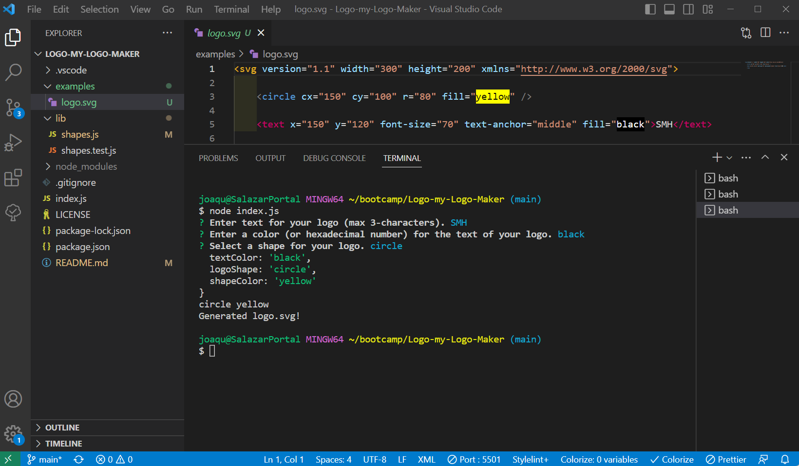

  

  # Logo-my-Logo-Maker

  ## Description
  
  This repository contains the files to create a company logo as an svg asset. This logo maker utilizes node js and the inquirer app to produce command line prompts that deliver a simple, attractive logo. 

  ## Table of Contents

- [Installation](#installation)
- [Usage](#usage)
- [License](#license)
- [Contributing](#contribution)
- [Tests](#tests)
- [Questions](#questions)

## Installation

Go to https://github.com/joaqsala/Logo-my-Logo-Maker and clone the respository. Go into the repository using your text editor and install inquirer using: npm i inquirer@8.2.4. Once installed, simply type 'node index.js' into the terminal and answer the prompts. A Generated logo.svg message will appear once it is complete.

## Usage 

Video walk through: https://watch.screencastify.com/v/5YhqAgWRWz2mWBdaoHNg

This application is intended for those who want a simple, no-hassle, scalable logo in svg format.  Using the command line interface, a series of questions will appear - one after another. The answers will be saved and used to design and render your logo in svg format.

## License

This project is covered under the MIT License.
 
  https://opensource.org/license/mit/

## Contribution

Contributions are always welcomed. Please submit a pull request.

## Tests

The project can be tested by running through the question prompts and then viewing the results. The project can also be tested by installing and using the jest npm application. To test the app or write your own tests, use the shapes.test.js file and enter 'node test' in the terminal.

## Questions

For any questions, please feel free to reach out. 

Github username: https://github.com/joaqsala

Email: joaqsala@gmail.com
